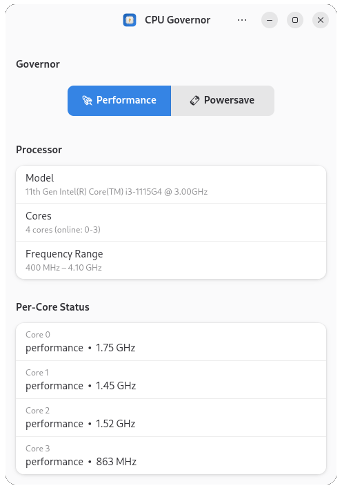
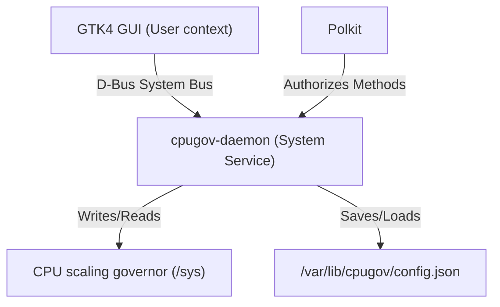

<div align="center">
  
  <h1>CPU Governor</h1>
</div>

A modern GTK4/libadwaita application for controlling your Linux CPU frequency scaling governor.


<p align="center">
  
</p>

## Features

- **Toggle CPU governors** — Switch between performance, powersave, and other available governors with a single click
- **Persistent across reboots** — Your chosen governor is saved and automatically restored on boot
- **Real-time monitoring** — Live per-core frequency display updated every 2 seconds
- **Secure privilege management** — Uses Polkit for authorization, no running the GUI as root
- **Modern GNOME design** — Built with GTK4 and libadwaita, supports dark/light themes
- **Multilanguage** — English, Spanish, Portuguese, Japanese, Chinese, and Italian

## Architecture

CPU Governor follows a secure system service architecture:



| Component | Description |
|-----------|-------------|
| **cpugov-daemon** | A D-Bus system service (runs as root) that manages CPU governors via sysfs |
| **cpugov-gtk** | A GTK4/libadwaita GUI (runs as user) that communicates with the daemon via D-Bus |

### Persistence

When you select a governor, the daemon saves your choice to `/var/lib/cpugov/config.json`. On the next boot, `cpugov-daemon.service` automatically restores your preferred setting.

## Installation

### Native Installation (Recommended)

The easiest way to install CPU Governor on Debian-based systems (Debian, Ubuntu, Parrot, etc.) is using the all-in-one `.deb` package which includes both the GUI and the system daemon:

1. Download the latest `.deb` from the [Releases](https://github.com/Serverket/cpugov/releases) page.
2. Install it using apt:
   ```bash
   sudo apt install ./cpugov_0.3.0-1_all.deb
   ```


## Development

**Prerequisites:** Python 3, PyGObject, D-Bus, Polkit, systemd (Daemon), GTK4 & libadwaita (GUI).

### Building from Source

```bash
# Build and install daemon + GUI locally
meson setup builddir
meson compile -C builddir
sudo meson install -C builddir

# Run the daemon service to test
sudo systemctl start cpugov-daemon
```

## License

[GPL-3.0-or-later](LICENSE)

## Acknowledgments

*"Whoever loves discipline loves knowledge, but whoever hates correction is stupid."*